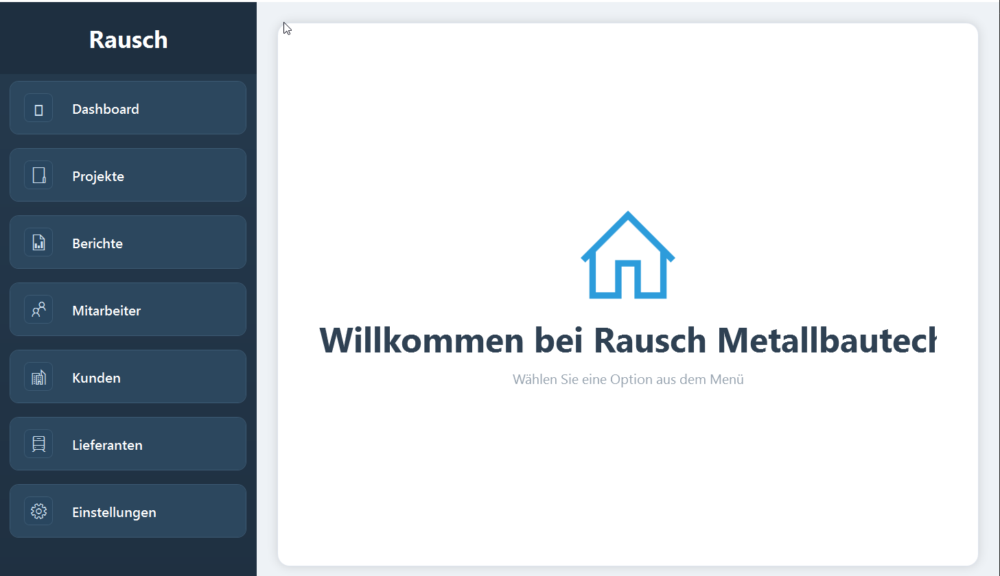
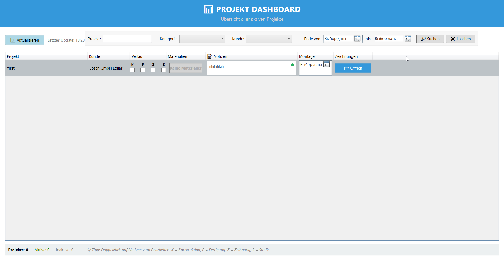
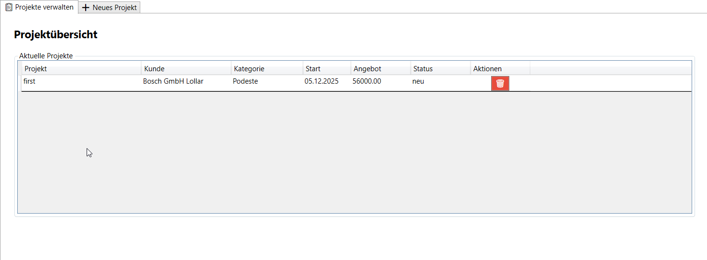
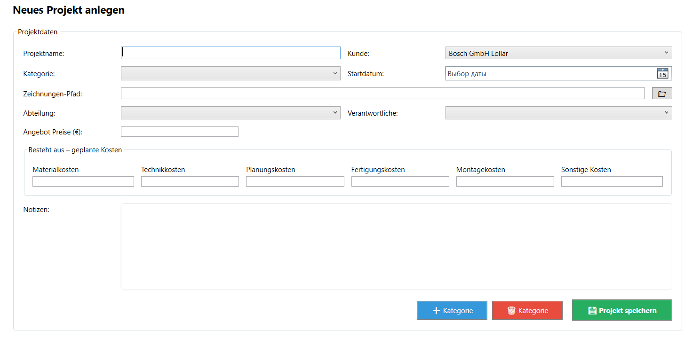
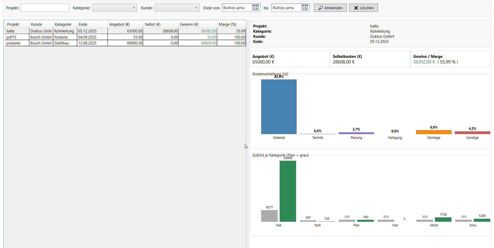
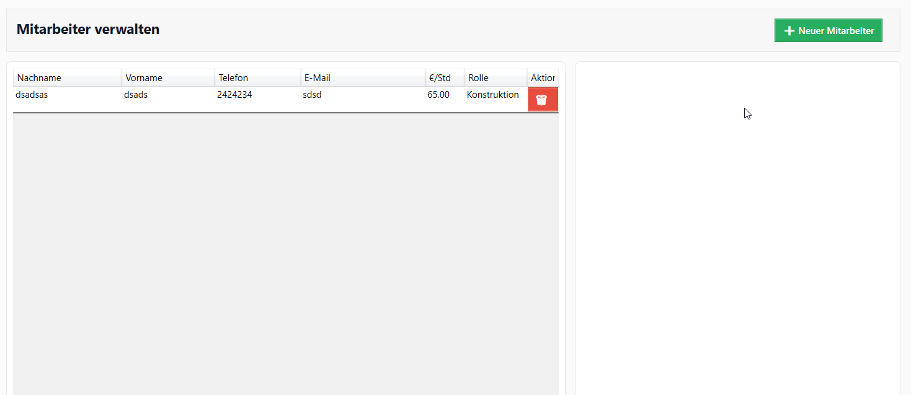
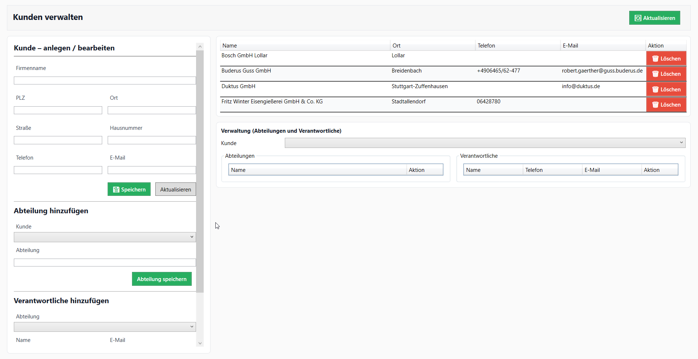
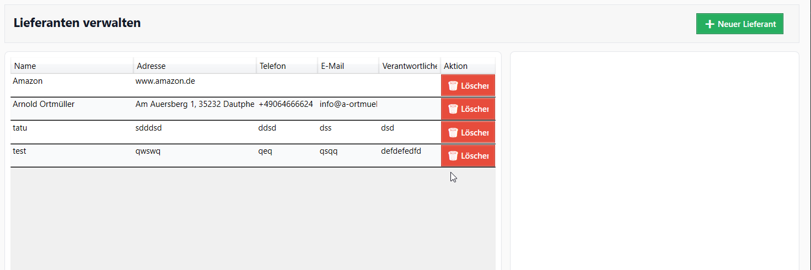
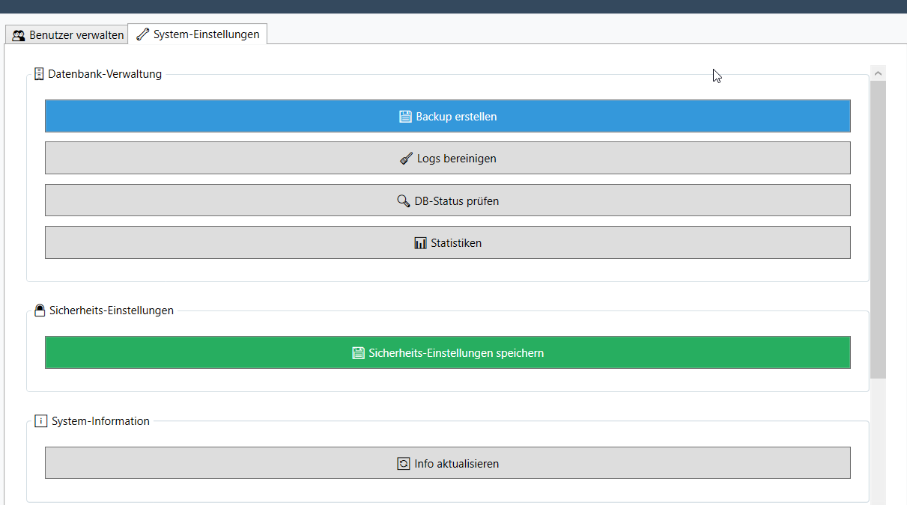

# Technische Projektpräsentation: C#-Desktopanwendung zur Projekt- und Kostenverwaltung

## 1. Projektüberblick

Diese Desktopanwendung wurde in **C#** entwickelt und dient der digitalen Verwaltung von Projekten, Kunden, Mitarbeitern, Lieferanten, Kostenstrukturen und projektbezogenen Auswertungen.

Ziel der Anwendung ist es, betriebliche Projektinformationen zentral zu erfassen, zu verwalten und wirtschaftlich auszuwerten. Dabei werden Projektdaten, geplante Kosten, tatsächliche Selbstkosten, Angebotspreise und Gewinnmargen in einer strukturierten Oberfläche zusammengeführt.

Die Anwendung unterstützt insbesondere folgende betriebliche Prozesse:

- Verwaltung laufender und abgeschlossener Projekte
- Erfassung von Projektstammdaten
- Verwaltung von Kunden, Mitarbeitern und Lieferanten
- Kostenplanung nach Kategorien
- Auswertung von Selbstkosten, Angebot und Gewinn
- grafische Darstellung der Kostenverteilung
- systemnahe Funktionen wie Backup, Log-Bereinigung und Datenbankstatus

Die Anwendung wurde als interne Desktoplösung konzipiert, um Arbeitsabläufe im Unternehmen transparenter, schneller und besser auswertbar zu machen.

---

## 2. Ziel der Anwendung

Das Hauptziel der Anwendung besteht darin, Projektinformationen und wirtschaftliche Kennzahlen nicht mehr verteilt oder manuell zu verwalten, sondern in einem zentralen System zusammenzuführen.

Vor allem im betrieblichen Alltag ist es wichtig, schnell erkennen zu können:

- welche Projekte aktiv sind
- welchem Kunden ein Projekt zugeordnet ist
- welche Kategorie ein Projekt besitzt
- welche Kosten geplant wurden
- welche tatsächlichen Selbstkosten entstanden sind
- welcher Gewinn oder welche Marge erreicht wurde
- welche Mitarbeiter, Kunden und Lieferanten beteiligt sind

Damit schafft die Anwendung eine technische Grundlage für bessere Projektkontrolle, Nachkalkulation und Managemententscheidungen.

---

## 3. Technologische Umsetzung

Die Anwendung wurde als **Desktopanwendung mit C#** umgesetzt.

| Bereich | Umsetzung |
|---|---|
| Programmiersprache | C# |
| Anwendungstyp | Desktopanwendung |
| Benutzeroberfläche | Formularbasierte GUI |
| Datenhaltung | Datenbankanbindung / strukturierte Datenspeicherung |
| Auswertung | Berechnung von Selbstkosten, Gewinn und Marge |
| Visualisierung | Diagramme zur Kostenverteilung |
| Systemfunktionen | Backup, Logs, DB-Status, Statistiken |

Die Anwendung ist so aufgebaut, dass fachliche Daten über Eingabemasken erfasst, verarbeitet, gespeichert und anschließend in Übersichten oder Berichten dargestellt werden können.

---

## 4. Hauptmenü und Navigationsstruktur

Das Hauptmenü bildet den Einstiegspunkt der Anwendung. Über die linke Navigationsleiste kann der Benutzer zwischen den zentralen Bereichen wechseln.

Verfügbare Hauptbereiche:

- Dashboard
- Projekte
- Berichte
- Mitarbeiter
- Kunden
- Lieferanten
- Einstellungen

Die Menüstruktur ist klar getrennt und orientiert sich an den wichtigsten Geschäftsobjekten des Unternehmens. Dadurch kann der Benutzer schnell zwischen Projektverwaltung, Stammdaten und Auswertungen wechseln.

Diese Struktur verbessert die Bedienbarkeit, weil alle Hauptfunktionen logisch gruppiert sind. Besonders im betrieblichen Einsatz ist eine einfache und schnelle Navigation wichtig, damit die Anwendung ohne lange Einarbeitung genutzt werden kann.

**Screenshot:**  


---

## 5. Projekt-Dashboard

Das Projekt-Dashboard bietet eine zentrale Übersicht über aktive Projekte. Es zeigt Projektdaten in tabellarischer Form und ermöglicht dem Benutzer, Projekte nach bestimmten Kriterien zu suchen oder zu filtern.

Sichtbare Funktionen im Dashboard:

- Aktualisieren der Projektübersicht
- Filter nach Projektname
- Filter nach Kategorie
- Filter nach Kunde
- Filter nach Enddatum
- Suche
- Zurücksetzen der Filter
- Anzeige aktiver Projekte
- Anzeige von Projektinformationen wie Kunde, Verlauf, Materialien, Notizen, Montage und Zeichnungen

Das Dashboard dient als operative Kontrollansicht. Der Benutzer kann schnell erkennen, welche Projekte vorhanden sind und welche Zusatzinformationen bereits hinterlegt wurden.

Besonders wichtig ist die Kombination aus tabellarischer Darstellung und Filterlogik. Dadurch kann auch bei vielen Projekten gezielt nach relevanten Projekten gesucht werden.

**Screenshot:**  


---

## 6. Projektübersicht und Projektverwaltung

Im Bereich „Projekte verwalten“ werden aktuelle Projekte übersichtlich dargestellt. Die Tabelle zeigt zentrale Projektinformationen wie Projektname, Kunde, Kategorie, Startdatum, Angebot, Status und verfügbare Aktionen.

Die Projektübersicht erfüllt mehrere Aufgaben:

- Darstellung aller aktuellen Projekte
- schneller Überblick über Kunden und Projektstatus
- Anzeige des Angebotspreises
- Möglichkeit zum Löschen einzelner Projekte
- Einstiegspunkt für die weitere Projektbearbeitung

Der Benutzer erkennt sofort, welche Projekte angelegt wurden und in welchem Status sie sich befinden. Dadurch wird die Projektverwaltung transparent und nachvollziehbar.

Die tabellarische Darstellung ist besonders geeignet für Verwaltungsaufgaben, weil sie viele Informationen kompakt und vergleichbar darstellt.

**Screenshot:**  


---

## 7. Neues Projekt anlegen

Die Maske „Neues Projekt anlegen“ ist ein zentraler Bestandteil der Anwendung. Hier werden alle wichtigen Projektdaten erfasst und mit den organisatorischen sowie wirtschaftlichen Projektinformationen verbunden.

Erfasste Projektdaten:

- Projektname
- Kunde
- Kategorie
- Startdatum
- Zeichnungen-Pfad
- Abteilung
- verantwortliche Person
- Angebotspreis
- Notizen

Zusätzlich können bereits bei der Projekterstellung geplante Kosten nach Kategorien hinterlegt werden:

- Materialkosten
- Technikkosten
- Planungskosten
- Fertigungskosten
- Montagekosten
- cd ..sonstige Kosten

Diese Unterteilung zeigt, dass die Anwendung nicht nur Projektstammdaten speichert, sondern bereits bei der Projekterstellung eine wirtschaftliche Planung ermöglicht. Dadurch kann später ein Vergleich zwischen geplanten Kosten und tatsächlichen Selbstkosten durchgeführt werden.

Ein besonders wichtiger Bestandteil ist der Zeichnungen-Pfad. Beim Anlegen eines neuen Projekts wird ein Speicherort ausgewählt, an dem die technischen Unterlagen abgelegt werden sollen. Nach dem Speichern des Projekts erstellt die Anwendung in diesem ausgewählten Pfad automatisch eine neue Projektmappe.

Diese Projektmappe enthält eine vorbereitete Schablone, die anschließend weiter ausgefüllt und für die Projektdokumentation genutzt werden kann. Dadurch wird nicht nur ein Datensatz in der Anwendung erstellt, sondern gleichzeitig auch eine einheitliche Ordnerstruktur für die technische Projektbearbeitung vorbereitet.

Das hat mehrere Vorteile:

technische Unterlagen werden direkt mit dem Projekt verbunden
jedes Projekt erhält automatisch eine eigene strukturierte Ablage
Zeichnungen und Dokumente können später schneller gefunden werden
die Projektdokumentation wird vereinheitlicht
manuelle Erstellung von Ordnern und Vorlagen wird reduziert
die Anwendung unterstützt nicht nur Verwaltung, sondern auch den praktischen Arbeitsablauf im Betrieb

Über die Schaltfläche „Projekt speichern“ werden die Projektdaten übernommen. Gleichzeitig wird die Projektmappe im ausgewählten Zeichnungen-Pfad vorbereitet. Danach steht das Projekt in der Projektübersicht zur Verfügung und kann später in Berichten und Auswertungen berücksichtigt werden.

**Screenshot:**  


---

## 8. Berichte und wirtschaftliche Auswertung

Der Bereich „Berichte“ zeigt die wirtschaftliche Auswertung der Projekte. Hier werden Angebotspreis, Selbstkosten, Gewinn und Marge gegenübergestellt.

Die linke Tabelle bietet eine Übersicht über mehrere Projekte mit folgenden Kennzahlen:

- Projekt
- Kunde
- Kategorie
- Ende
- Angebot
- Selbstkosten
- Gewinn
- Marge

Nach Auswahl eines Projekts werden rechts die Detaildaten angezeigt. Dazu gehören:

- Projektname
- Kategorie
- Kunde
- Enddatum
- Angebotspreis
- Selbstkosten
- Gewinn / Marge

Diese Ansicht ist fachlich besonders wichtig, weil sie nicht nur Daten speichert, sondern betriebswirtschaftliche Aussagen ermöglicht.

Die Anwendung berechnet aus Angebot und Selbstkosten den Gewinn sowie die Marge. Dadurch kann schnell beurteilt werden, ob ein Projekt wirtschaftlich erfolgreich war.

### Beispielhafte Berechnungslogik

```text
Gewinn = Angebotspreis - Selbstkosten

Marge (%) = Gewinn / Angebotspreis * 100
```

Diese Kennzahlen sind für die Nachkalkulation entscheidend. Sie zeigen, ob die ursprüngliche Planung realistisch war und wie profitabel ein Projekt abgeschlossen wurde.

**Screenshot:**  


---

## 9. Grafische Kostenanalyse

Neben tabellarischen Kennzahlen enthält die Berichtseite auch Diagramme. Diese visualisieren die Verteilung der Kosten nach Kategorien.

Dargestellt werden unter anderem:

- Kostenverteilung nach Material
- Technik
- Planung
- Fertigung
- Montage
- sonstige Kosten

Außerdem wird ein Soll-Ist-Vergleich je Kategorie dargestellt. Dabei werden geplante Werte und tatsächliche Werte gegenübergestellt.

Der Vorteil dieser Darstellung liegt darin, dass Abweichungen sofort sichtbar werden. Der Benutzer muss nicht nur Zahlen vergleichen, sondern erkennt direkt, in welchen Bereichen die tatsächlichen Kosten höher oder niedriger als geplant waren.

Diese Visualisierung macht die Anwendung deutlich stärker, weil sie Managemententscheidungen unterstützt und wirtschaftliche Projektbewertung erleichtert.

---

## 10. Mitarbeiterverwaltung

Im Bereich „Mitarbeiter verwalten“ können Mitarbeiterdaten zentral gepflegt werden.

Erfasste Informationen:

- Nachname
- Vorname
- Telefon
- E-Mail
- Stundensatz
- Rolle

Der Stundensatz ist besonders wichtig für die spätere Kostenberechnung. Wenn Mitarbeiterzeiten oder Tätigkeiten mit einem Stundensatz verbunden werden, können daraus Personalkosten oder Selbstkosten berechnet werden.

Die Rolle zeigt, in welchem Bereich ein Mitarbeiter eingesetzt wird, zum Beispiel Konstruktion, Fertigung, Montage oder Verwaltung.

Die Mitarbeiterverwaltung bildet damit eine wichtige Grundlage für die betriebswirtschaftliche Auswertung. Ohne gepflegte Mitarbeiterdaten wären genaue Kostenberechnungen schwieriger.

**Screenshot:**  


---

## 11. Kundenverwaltung

Die Kundenverwaltung dient zur Erfassung und Pflege von Kundendaten.

Erfasste Kundendaten:

- Firmenname
- PLZ
- Ort
- Straße
- Hausnummer
- Telefon
- E-Mail

Zusätzlich können Abteilungen und verantwortliche Personen zu einem Kunden verwaltet werden.

Diese Struktur ist praxisnah, weil größere Kunden oft verschiedene Abteilungen und Ansprechpartner besitzen. Die Anwendung ermöglicht deshalb nicht nur die Speicherung eines Kundennamens, sondern auch eine detailliertere organisatorische Zuordnung.

Die Kundenverwaltung hat direkten Bezug zur Projektverwaltung. Beim Anlegen eines Projekts kann ein Kunde ausgewählt werden. Dadurch entsteht eine saubere Verbindung zwischen Projekt und Auftraggeber.

**Screenshot:**  


---

## 12. Lieferantenverwaltung

Die Lieferantenverwaltung ermöglicht die zentrale Pflege von Lieferantendaten.

Erfasste Informationen:

- Name
- Adresse
- Telefon
- E-Mail
- verantwortliche Person

Lieferanten sind für Projekte relevant, weil Material, externe Leistungen oder spezielle Komponenten häufig von externen Partnern stammen. Durch die Speicherung der Lieferantendaten können diese Informationen zentral verwaltet und bei Bedarf schnell abgerufen werden.

Die Lieferantenverwaltung ergänzt damit die Projekt- und Kostenverwaltung um einen wichtigen Bereich der betrieblichen Stammdaten.

**Screenshot:**  


---

## 13. Systemeinstellungen und Administration

Der Bereich „System-Einstellungen“ enthält administrative Funktionen. Diese Funktionen zeigen, dass die Anwendung nicht nur eine einfache Oberfläche für Projektdaten ist, sondern auch systemnahe Verwaltungsfunktionen besitzt.

Vorhandene Funktionen:

- Backup erstellen
- Logs bereinigen
- Datenbankstatus prüfen
- Statistiken anzeigen
- Sicherheitseinstellungen speichern
- Systeminformationen aktualisieren

Diese Funktionen sind besonders wichtig für Betrieb, Wartung und Datensicherheit.

### Backup erstellen

Mit der Backup-Funktion können wichtige Daten gesichert werden. Das ist notwendig, um Datenverlust zu vermeiden und die Anwendung im Unternehmensalltag zuverlässiger zu machen.

### Logs bereinigen

Logdateien können mit der Zeit sehr groß werden. Eine Bereinigungsfunktion hilft dabei, das System übersichtlich und wartbar zu halten.

### Datenbankstatus prüfen

Die Prüfung des Datenbankstatus ermöglicht eine schnelle technische Kontrolle, ob die Datenverbindung funktioniert.

### Sicherheitseinstellungen

Sicherheitseinstellungen sind wichtig, um den Zugriff und den Betrieb der Anwendung kontrollierbar zu halten.

**Screenshot:**  


---

## 14. Datenmodell und fachliche Struktur

Die Anwendung basiert fachlich auf mehreren zentralen Datenobjekten.

Wichtige Entitäten:

```text
Projekt
Kunde
Mitarbeiter
Lieferant
Kategorie
Abteilung
Verantwortliche Person
Kostenposition
Bericht
Systemeinstellung
```

Diese Entitäten stehen logisch miteinander in Beziehung.

Beispielhafte Zusammenhänge:

```text
Ein Kunde kann mehrere Projekte haben.
Ein Projekt gehört zu genau einem Kunden.
Ein Projekt besitzt eine Kategorie.
Ein Projekt kann geplante Kosten in mehreren Kostenbereichen enthalten.
Ein Mitarbeiter besitzt eine Rolle und einen Stundensatz.
Ein Projekt kann einer Abteilung und einer verantwortlichen Person zugeordnet werden.
Ein Bericht wertet Angebot, Selbstkosten, Gewinn und Marge aus.
```

Diese fachliche Struktur macht die Anwendung erweiterbar. Neue Module, zusätzliche Kostenarten oder weitere Auswertungen können später ergänzt werden.

---

## 15. Berechnungslogik

Ein technischer Kern der Anwendung ist die Berechnung wirtschaftlicher Kennzahlen.

Die Anwendung verarbeitet geplante und tatsächliche Kosten und stellt sie dem Angebotspreis gegenüber.

Wichtige Kennzahlen:

```text
Selbstkosten = Summe aller relevanten Kostenbereiche

Gewinn = Angebotspreis - Selbstkosten

Marge (%) = Gewinn / Angebotspreis * 100
```

Zusätzlich können Kostenbereiche einzeln betrachtet werden:

```text
Materialkosten
Technikkosten
Planungskosten
Fertigungskosten
Montagekosten
Sonstige Kosten
```

Diese Berechnungslogik ist entscheidend, weil sie aus reinen Eingabedaten betriebswirtschaftlich nutzbare Informationen erzeugt.

Damit wird aus der Anwendung ein Werkzeug zur Entscheidungsunterstützung.

---

## 16. Benutzerführung und Usability

Die Anwendung verwendet eine klare visuelle Struktur:

- Navigation links
- Arbeitsbereich rechts
- Tabellen für Übersichten
- Eingabemasken für Stammdaten
- farbige Schaltflächen für Aktionen
- Diagramme für Auswertungen

Die wichtigsten Aktionen sind visuell hervorgehoben:

- grün für Speichern oder neue Einträge
- rot für Löschen
- blau für Öffnen, Aktualisieren oder Systemaktionen

Dadurch erkennt der Benutzer schnell, welche Aktion ausgeführt werden kann. Die Oberfläche ist funktional, direkt und auf Verwaltungsprozesse ausgerichtet.

---

## 17. Qualität und Wartbarkeit

Die Anwendung zeigt mehrere Merkmale, die für eine wartbare betriebliche Software wichtig sind:

- getrennte Bereiche für Projekte, Kunden, Mitarbeiter und Lieferanten
- klare Eingabemasken
- tabellarische Datenübersichten
- Filter- und Suchfunktionen
- zentrale Systemeinstellungen
- Backup-Möglichkeit
- Log-Bereinigung
- Datenbankstatusprüfung
- wirtschaftliche Berichte mit Diagrammen

Diese Funktionen unterstützen nicht nur den Benutzer, sondern auch die spätere Pflege und Erweiterung der Anwendung.

---

## 18. Fachlicher Nutzen für das Unternehmen

Die Anwendung verbessert die Transparenz und Organisation im Projektgeschäft.

Konkreter Nutzen:

- zentrale Verwaltung aller Projektdaten
- bessere Übersicht über aktive Projekte
- strukturierte Kunden- und Lieferantendaten
- transparente Kostenplanung
- automatische Berechnung von Gewinn und Marge
- bessere Nachkalkulation abgeschlossener Projekte
- schnelle Erkennung wirtschaftlicher Abweichungen
- Grundlage für zukünftige Projektplanung
- technische Unterstützung durch Backup und Systemprüfung

Dadurch wird die Anwendung zu einem wichtigen Werkzeug für Digitalisierung, Kostenkontrolle und betriebliche Effizienz.

---

## 19. Projektstärke

Die besondere Stärke der Anwendung liegt in der Kombination aus technischer Umsetzung und betrieblichem Nutzen.

Es wurden nicht nur einzelne Formulare erstellt, sondern ein zusammenhängendes System mit mehreren Modulen:

- Projektverwaltung
- Kostenplanung
- Berichtsauswertung
- Kundenverwaltung
- Mitarbeiterverwaltung
- Lieferantenverwaltung
- Administration
- Systemwartung

Dadurch zeigt das Projekt mehrere wichtige Kompetenzen:

- objektorientierte Softwareentwicklung mit C#
- Aufbau einer Desktop-GUI
- strukturierte Datenverarbeitung
- Arbeit mit Tabellen und Formularen
- Umsetzung betrieblicher Anforderungen
- Berechnung wirtschaftlicher Kennzahlen
- Visualisierung von Daten
- Aufbau administrativer Funktionen

---

## 20. Fazit

Mit dieser C#-Desktopanwendung wurde eine praxisnahe Softwarelösung für Projektverwaltung und Kostenanalyse entwickelt.

Die Anwendung ermöglicht eine zentrale Verwaltung von Projekten, Kunden, Mitarbeitern und Lieferanten. Gleichzeitig bietet sie wirtschaftliche Auswertungen, Diagramme und administrative Systemfunktionen.

Besonders wichtig ist, dass die Anwendung betriebliche Daten nicht nur speichert, sondern daraus verwertbare Informationen erzeugt. Durch die Berechnung von Selbstkosten, Gewinn und Marge unterstützt sie die Nachkalkulation und verbessert die Entscheidungsgrundlage im Unternehmen.

Das Projekt zeigt damit eine vollständige Umsetzung von der Benutzeroberfläche über die Datenstruktur bis zur fachlichen Auswertung.

---

## 21. Ausblick

Die Anwendung kann zukünftig weiterentwickelt werden.

Mögliche Erweiterungen:

- direkte Integration mit einer Webanwendung zur Zeiterfassung
- automatische Übernahme von Arbeitszeiten in die Selbstkostenberechnung
- Export von Berichten als PDF oder Excel
- detaillierte Rollen- und Rechteverwaltung
- Mehrbenutzerbetrieb im Netzwerk
- erweiterte Diagramme und Kennzahlen
- Soll-Ist-Analyse mit Warnhinweisen
- automatische Projektarchivierung
- Schnittstelle zu Buchhaltung oder ERP-System
- KI-gestützte Analyse von Kostenabweichungen

Besonders sinnvoll wäre die Verbindung mit einer Zeiterfassung, damit tatsächliche Arbeitszeiten automatisch in die Projektkosten einfließen. Dadurch könnte die Anwendung zu einem vollständigen System für Projektsteuerung, Zeiterfassung und Nachkalkulation erweitert werden.

---

# Kurzer Präsentationstext

Diese C#-Desktopanwendung wurde entwickelt, um Projekte, Kunden, Mitarbeiter, Lieferanten und wirtschaftliche Projektdaten zentral zu verwalten.

Über das Hauptmenü kann der Benutzer zwischen Dashboard, Projekten, Berichten, Mitarbeitern, Kunden, Lieferanten und Einstellungen wechseln. Im Projektbereich können neue Projekte angelegt, Kunden zugeordnet, Kategorien gewählt und geplante Kosten erfasst werden.

Ein wichtiger Bestandteil ist die Berichtsfunktion. Dort werden Angebotspreis, Selbstkosten, Gewinn und Marge berechnet und grafisch dargestellt. Dadurch kann das Unternehmen erkennen, wie wirtschaftlich ein Projekt war und in welchen Kostenbereichen Abweichungen entstanden sind.

Zusätzlich bietet die Anwendung administrative Funktionen wie Backup, Log-Bereinigung, Datenbankstatusprüfung und Sicherheitseinstellungen.

Damit ist die Anwendung nicht nur eine einfache Verwaltungsoberfläche, sondern ein technisches Werkzeug zur Digitalisierung von Projektverwaltung, Kostenkontrolle und Nachkalkulation.
