# Projektpräsentation: Webanwendung zur projektbezogenen Zeiterfassung

## 1. Projektidee und Zielsetzung

Die entwickelte Webanwendung dient der digitalen, projektbezogenen Zeiterfassung in einem betrieblichen Umfeld. Ziel ist es, Arbeitszeiten nicht nur allgemein zu erfassen, sondern sie eindeutig Projekten, Tätigkeitsbereichen und verantwortlichen Personen zuzuordnen.

Dadurch entsteht eine transparente Datengrundlage für die spätere Auswertung von Projekten. Die Anwendung unterstützt sowohl das Management als auch Fertigungsmitarbeiter und Installateure bei der strukturierten Erfassung von Arbeitszeiten.

Der besondere Mehrwert der Anwendung liegt darin, dass verschiedene Arbeitsbereiche getrennt, aber innerhalb eines gemeinsamen Projekts erfasst werden können. So lassen sich später nicht nur die Gesamtzeiten eines Projekts auswerten, sondern auch einzelne Tätigkeitsbereiche, beteiligte Mitarbeiter und der tatsächliche zeitliche Aufwand pro Projektphase.

---

## 2. Ausgangssituation

Vor der Entwicklung der Anwendung gab es keine durchgehend digitale und projektbezogene Zeiterfassung. Arbeitszeiten konnten dadurch nur schwer einzelnen Projekten, Tätigkeiten oder Mitarbeitern zugeordnet werden.

Das führte zu mehreren praktischen Problemen:

- Projektzeiten waren nicht ausreichend transparent.
- Der tatsächliche Aufwand einzelner Tätigkeiten war schwer nachvollziehbar.
- Eine genaue Nachkalkulation war nur eingeschränkt möglich.
- Fertigung, Montage und Management hatten keine einheitliche digitale Grundlage.
- Die Auswertung musste manuell oder unvollständig erfolgen.
- Es war schwer zu erkennen, wer wie lange an welchem Projektbereich gearbeitet hat.

Die Anwendung wurde entwickelt, um genau diese Schwachstellen zu lösen.

**Screenshot:**  
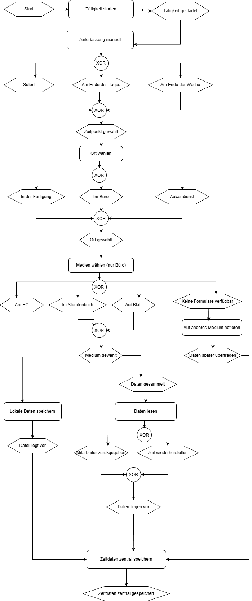

---

## 3. Registrierung mit Teamcode

Der erste Schritt in der Anwendung ist die Registrierung. Dabei wurde ein Teamcode-Konzept umgesetzt.

Mit einem Teamcode kann sich ein Benutzer einem bestehenden Team zuordnen. Dadurch wird ermöglicht, dass mehrere Benutzer gemeinsam an denselben Projekten arbeiten und ihre Arbeitszeiten innerhalb einer gemeinsamen Teamstruktur erfassen.

Wenn kein Teamcode verwendet wird, kann der Benutzer die Anwendung trotzdem nutzen, allerdings nur für eigene Projekte. In diesem Fall arbeitet der Benutzer unabhängig von einem Team.

Diese Logik ist wichtig, weil die Anwendung dadurch flexibel einsetzbar ist:

- Einzelpersonen können eigene Projekte verwalten.
- Teams können gemeinsam an Projekten arbeiten.
- Der Zugriff auf Teamdaten wird kontrolliert.
- Projekte und Zeiteinträge bleiben organisatorisch sauber getrennt.

Der Teamcode verhindert außerdem, dass beliebige Benutzer Zugriff auf fremde Projekte erhalten. Nur Personen mit gültigem Code können einem Team beitreten.

**Screenshot:**  
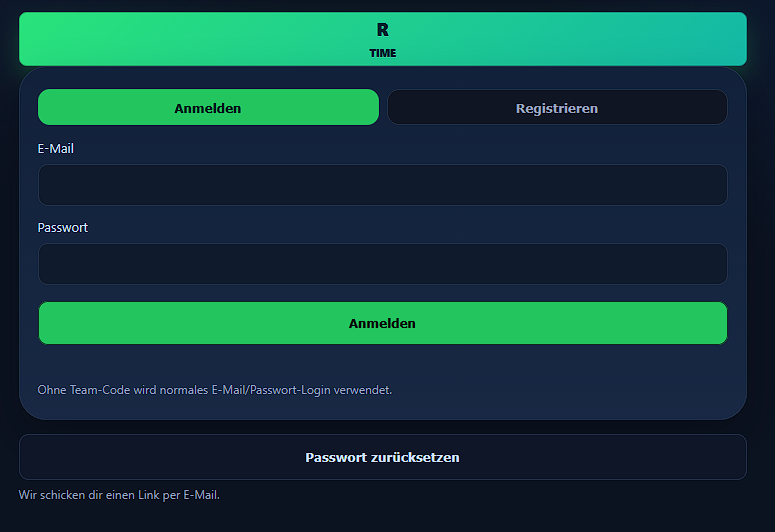

---

## 4. Anmeldung und Benutzerzugang

Nach der Registrierung erfolgt die Anmeldung in der Anwendung. Der Benutzer gelangt nach erfolgreichem Login in den für seine Rolle vorgesehenen Bereich.

Die Anwendung unterscheidet verschiedene Zugänge und Rollen:

- Manager / Verwaltung
- Fertigung
- Installateur / Monteur
- Einzelbenutzer ohne Teamcode

Diese Rollen sind wichtig, weil nicht jeder Benutzer dieselben Informationen sehen oder dieselben Aktionen ausführen soll. Der Manager benötigt einen Überblick über Projekte, Mitarbeiter, Zeiten und Auswertungen. Die Fertigung soll dagegen nur die eigenen relevanten Tätigkeiten sehen und Arbeitszeiten erfassen. Der Installateur erhält eine stark reduzierte Oberfläche, die nur über einen QR-Code erreichbar ist.

Dadurch wird die Anwendung übersichtlicher, sicherer und praxisnäher.

**Screenshot:**  
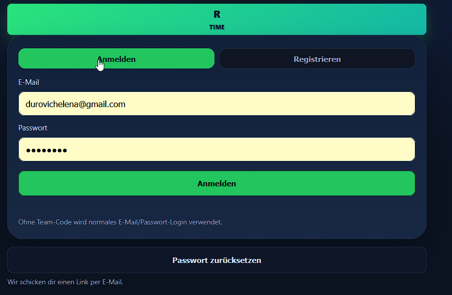

---

## 5. Manager-Dashboard als zentrales Kachelpanel

Das Manager-Dashboard ist der zentrale Arbeitsbereich der Anwendung. Es ist als Kachelpanel aufgebaut und zeigt die vorhandenen Projekte übersichtlich an.

Jede Kachel steht für ein Projekt. Auf diese Weise kann der Manager schnell erkennen, welche Projekte vorhanden sind und welchen Status sie aktuell haben.

Mögliche Projektstatus sind zum Beispiel:

- aktiv
- in Bearbeitung
- pausiert
- abgeschlossen

Das Dashboard dient nicht nur als Übersicht, sondern auch als Einstiegspunkt in die Projektbearbeitung. Durch einen Klick auf ein Projekt öffnet sich der jeweilige Projektbereich, in dem Arbeitszeiten erfasst, Tätigkeiten durchgeführt und später Auswertungen erstellt werden können.

Der Vorteil eines Kachelpanels liegt in der einfachen Bedienung. Auch ohne lange Einarbeitung kann der Benutzer sofort erkennen, welche Projekte existieren und welches Projekt bearbeitet werden soll.

**Screenshot:**  
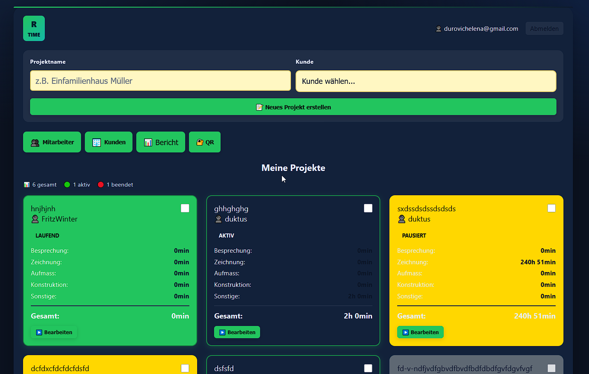

---

## 6. Projektverwaltung

Im Dashboard kann der Manager neue Projekte erstellen und vorhandene Projekte verwalten.

Ein Projekt bildet in der Anwendung die zentrale Einheit. Alle Zeiteinträge, Tätigkeiten, Mitarbeiter und späteren Berichte werden einem konkreten Projekt zugeordnet.

Die Projektverwaltung ermöglicht:

- neue Projekte anzulegen
- bestehende Projekte zu öffnen
- Projektstatus zu erkennen
- Projektfortschritt nachzuvollziehen
- Projektzeiten gesammelt auszuwerten
- Projekte nach Abschluss zu beenden

Diese Struktur ist besonders wichtig, weil alle späteren Auswertungen auf der korrekten Projektzuordnung basieren. Ohne Projektstruktur wären die erfassten Zeiten nicht sinnvoll analysierbar.

**Screenshot:**  
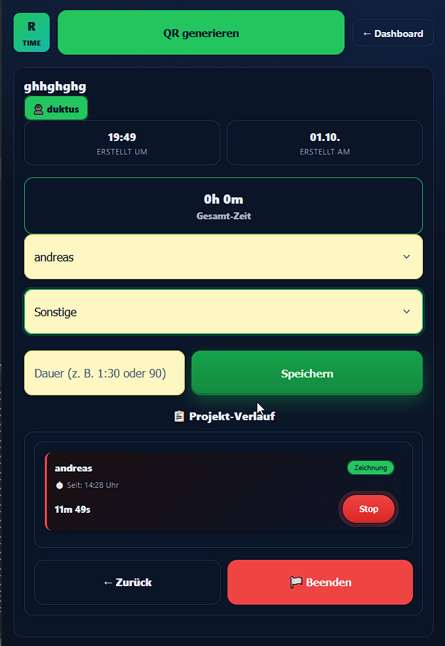

---

## 7. Durchführung eines Projekts mit Start-/Stopp-Funktion

Wenn der Manager auf ein Projekt klickt, kann das Projekt aktiv bearbeitet werden. In diesem Bereich wird die eigentliche Zeiterfassung durchgeführt.

Der Benutzer wählt zuerst eine Tätigkeit aus einer Liste aus. Danach wird der zuständige Mitarbeiter ausgewählt. Anschließend kann die Arbeit über eine Start-/Stopp-Funktion gestartet werden.

Der Ablauf ist:

1. Projekt öffnen
2. Tätigkeit auswählen
3. Mitarbeiter auswählen
4. Start drücken
5. Tätigkeit durchführen
6. Stop drücken
7. Arbeitszeit wird automatisch gespeichert

Die Start-/Stopp-Funktion reduziert manuelle Eingaben und erhöht die Genauigkeit der Zeiterfassung. Der Benutzer muss nicht selbst berechnen, wie lange eine Tätigkeit gedauert hat. Die Anwendung speichert Beginn, Ende und Dauer automatisch.

Zusätzlich kann die Zeit auch manuell angegeben werden. Das ist wichtig, falls eine Tätigkeit nachgetragen werden muss oder die Start-/Stopp-Funktion in einer bestimmten Situation nicht verwendet wurde.

**Screenshot:**  
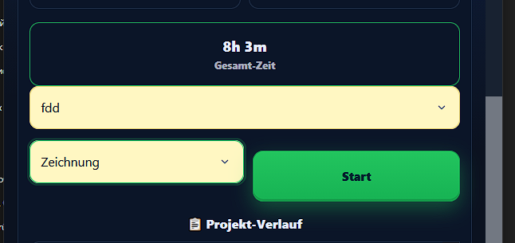
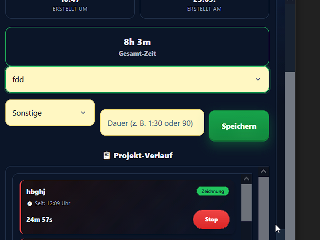

---

## 8. Tätigkeitsbereiche und Mitarbeiterzuordnung

Ein wichtiger Bestandteil der Anwendung ist die Zuordnung der Zeit zu konkreten Tätigkeitsbereichen.

Beispiele für Tätigkeiten können sein:

- Besprechung
- Zeichnung
- Aufmaß
- Vorbereitung
- Sonstiges

Durch diese Unterteilung wird später sichtbar, in welchem Bereich besonders viel Zeit aufgewendet wurde. Das ist für die Analyse und Nachkalkulation sehr wichtig.

Zusätzlich wird jeder Zeiteintrag einem Mitarbeiter zugeordnet. Dadurch kann später ausgewertet werden:

- welcher Mitarbeiter an welchem Projekt beteiligt war
- wie lange ein Mitarbeiter an einem Projekt gearbeitet hat
- welche Tätigkeiten von welchen Personen durchgeführt wurden
- wie sich die Arbeitszeit auf verschiedene Bereiche verteilt

Diese Kombination aus Projekt, Tätigkeit und Mitarbeiter macht die Anwendung deutlich aussagekräftiger als eine einfache Zeiterfassung.

---

## 9. Stoppen und Speichern der Tätigkeit

Wenn eine Tätigkeit abgeschlossen ist, wird die Zeiterfassung über die Stop-Funktion beendet.

Beim Stoppen wird die Arbeitszeit automatisch berechnet und gespeichert. Dadurch entsteht ein sauberer Zeiteintrag mit Beginn, Ende, Dauer, Tätigkeit, Projekt und Mitarbeiter.

Diese Daten sind später die Grundlage für die Berichte und Analysen.

Der Vorteil dieser Lösung ist, dass Arbeitszeiten nicht nur gesammelt, sondern strukturiert gespeichert werden. Jeder Eintrag besitzt einen fachlichen Zusammenhang und kann später gezielt ausgewertet werden.

**Screenshot:**  
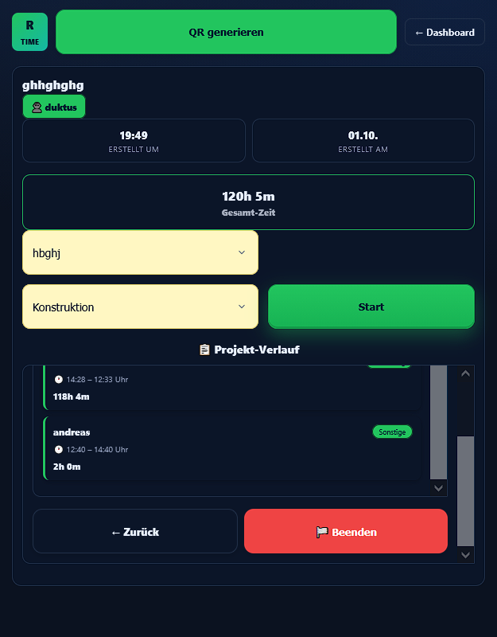
**Screenshot Bericht**  
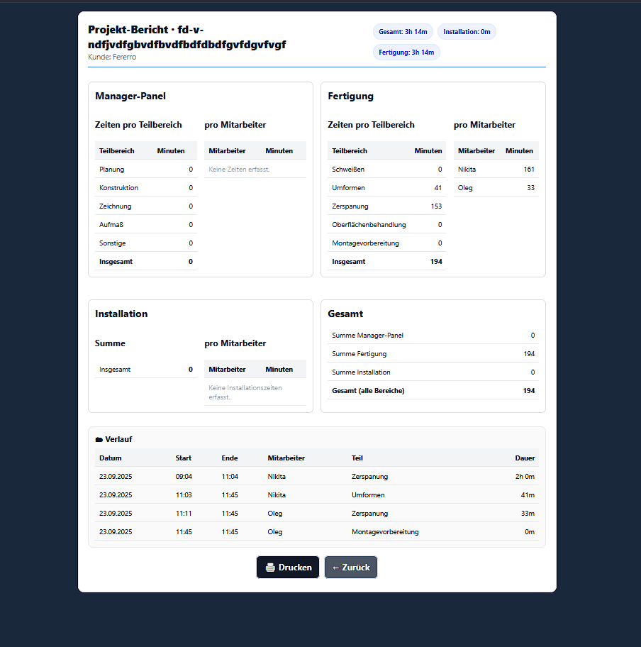
---

## 10. Separates Dashboard für die Fertigung

Neben dem Manager-Dashboard gibt es ein eigenes Dashboard für die Fertigung.

Die Fertigung sieht nicht alle Managementdaten, sondern nur die für sie relevanten Tätigkeiten. Dadurch wird die Benutzeroberfläche bewusst vereinfacht und auf die praktische Arbeit reduziert.

Die Fertigung kann ebenfalls mit der Start-/Stopp-Funktion arbeiten. Der Ablauf ist ähnlich wie beim Manager:

1. relevante Tätigkeit auswählen
2. Start drücken
3. Arbeit durchführen
4. Stop drücken
5. Zeit wird gespeichert

Der Unterschied liegt in der Sichtbarkeit der Daten. Die Fertigung sieht nur ihre eigenen Tätigkeiten und nicht die vollständigen Managementinformationen. Dadurch wird verhindert, dass unnötige oder sensible Daten angezeigt werden.

Diese rollenbasierte Trennung macht die Anwendung sicherer und benutzerfreundlicher.

**Screenshot:**  
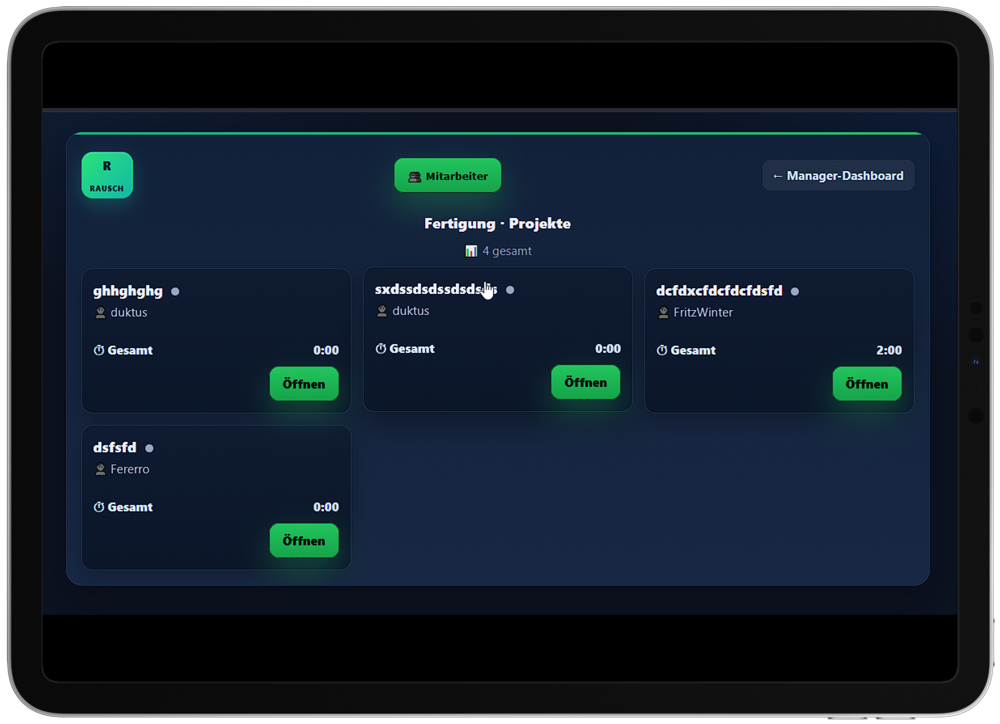

---

## 11. Minimalistische Installateur-Seite über QR-Code

Für Installateure beziehungsweise Monteure wurde eine minimalistische Seite vorgesehen. Diese Seite ist bewusst sehr einfach gehalten, damit sie schnell und unkompliziert genutzt werden kann.

Der Zugriff erfolgt nicht über das normale Dashboard, sondern über einen QR-Code. Diesen QR-Code kann nur der Manager bereitstellen.

Das QR-Konzept hat mehrere Vorteile:

- Der Installateur benötigt keinen vollständigen Zugang zum System.
- Die Bedienung ist sehr einfach.
- Der Zugriff ist zeitlich begrenzt.
- Der Manager behält die Kontrolle darüber, wer Zugang erhält.
- Die Installateur-Zeiten können trotzdem projektbezogen erfasst werden.

Der QR-Code für Installateure ist nur für wenige Tage gültig. Dadurch wird verhindert, dass ein alter QR-Code dauerhaft genutzt werden kann.

Für die Fertigung kann der Manager dagegen einen langfristigen QR-Code bereitstellen. Das ist sinnvoll, weil die Fertigung regelmäßig mit der Anwendung arbeitet und einen dauerhafteren Zugang benötigt.

**Screenshot:**  
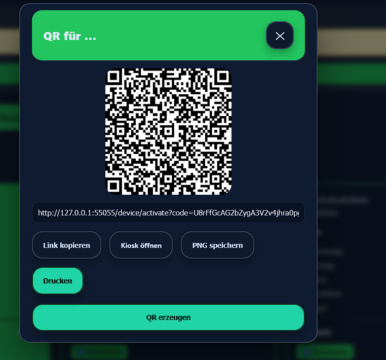

---

## 12. Rollen- und Zugriffskonzept

Die Anwendung verwendet ein rollenbasiertes Zugriffskonzept. Dadurch erhält jede Benutzergruppe nur die Funktionen und Informationen, die sie tatsächlich benötigt.

### Manager

Der Manager besitzt den umfassendsten Zugriff. Er kann:

- Projekte erstellen
- Projekte verwalten
- Mitarbeiter auswählen
- Tätigkeiten erfassen
- QR-Codes bereitstellen
- Projekte beenden
- Berichte erstellen
- Daten analysieren

### Fertigung

Die Fertigung arbeitet mit einer reduzierten Oberfläche. Sie kann:

- eigene Tätigkeiten sehen
- Zeiten starten und stoppen
- Arbeitszeiten für relevante Aufgaben erfassen

Die Fertigung sieht keine vollständigen Managementangaben.

### Installateur

Der Installateur erhält Zugriff über einen QR-Code. Er kann nur die minimal notwendigen Funktionen nutzen, um Arbeitszeit für ein Projekt zu erfassen.

### Benutzer ohne Teamcode

Ein Benutzer ohne Teamcode kann eigene Projekte erstellen und bearbeiten, arbeitet aber nicht innerhalb eines Teams.

Dieses Zugriffskonzept sorgt für Datenschutz, Übersichtlichkeit und eine klare Trennung der Verantwortlichkeiten.

---

## 13. Projektabschluss

Ein Projekt kann erst dann vollständig ausgewertet werden, wenn es vom Manager beendet wurde.

Der Manager klickt dazu auf „Projekt beenden“. Erst danach werden Berichtserstellung und tiefere Analyse freigegeben.

Diese Logik ist bewusst gewählt. Solange ein Projekt noch läuft, können weitere Zeiten entstehen. Würde man zu früh einen Abschlussbericht erstellen, könnten die Daten unvollständig sein.

Der Projektabschluss sorgt deshalb für einen klaren fachlichen Zustand:

- Das Projekt ist beendet.
- Es werden keine weiteren Zeiten mehr erwartet.
- Die vorhandenen Daten können ausgewertet werden.
- Der Abschlussbericht basiert auf einem vollständigen Datenstand.

Damit wird die Auswertung zuverlässiger und fachlich nachvollziehbar.

**Screenshot:**  

---

## 14. Berichtserstellung und Datenanalyse

Nach dem Projektabschluss kann der Manager einen Bericht erstellen und die erfassten Daten analysieren.

Die Analyse zeigt, wie viel Zeit in den verschiedenen Bereichen des Projekts aufgewendet wurde. Dadurch entsteht eine transparente Grundlage für Nachkalkulation, Bewertung und zukünftige Planung.

Ausgewertet werden kann zum Beispiel:

- wie lange das Projekt insgesamt gedauert hat
- wie viel Zeit in der Fertigung entstanden ist
- wie viel Zeit durch Installateure erfasst wurde
- welcher Mitarbeiter in welchem Bereich tätig war
- wie viele Stunden auf bestimmte Tätigkeiten entfallen sind
- welche Projektbereiche besonders zeitintensiv waren

Diese Auswertung ist ein zentraler Nutzen der Anwendung. Sie macht sichtbar, welche Arbeit tatsächlich hinter einem Projekt steht.

Für das Unternehmen bedeutet das:

- bessere Nachkalkulation
- bessere Planung zukünftiger Projekte
- mehr Transparenz über Arbeitsaufwände
- bessere Entscheidungsgrundlage für Management und Organisation
- nachvollziehbare Dokumentation der geleisteten Arbeit

---

## 15. Fachlicher Mehrwert des Projekts

Die Anwendung ist nicht nur eine einfache Zeiterfassung, sondern ein digitales Werkzeug zur Verbesserung betrieblicher Abläufe.

Der fachliche Mehrwert besteht darin, dass Arbeitszeiten strukturiert erfasst und später sinnvoll analysiert werden können.

Besonders wichtig sind dabei:

- die Teamarbeit über Teamcode
- die klare Trennung der Rollen
- die einfache Bedienung für verschiedene Benutzergruppen
- die Start-/Stopp-Funktion
- die manuelle Zeiterfassung als Ergänzung
- die QR-Code-Lösung für Fertigung und Installateure
- der kontrollierte Projektabschluss
- die Berichtserstellung erst nach Abschluss
- die Analyse nach Projekt, Tätigkeit und Mitarbeiter

Die Anwendung unterstützt damit die Digitalisierung von Arbeitsprozessen im Unternehmen.

---

## 16. Technische und organisatorische Stärke der Lösung

Die Anwendung verbindet technische Umsetzung mit praktischem Nutzen.

Technisch wurden mehrere wichtige Anforderungen umgesetzt:

- Benutzerregistrierung
- Anmeldung
- Teamcode-Logik
- Rollenmodell
- Projektverwaltung
- Statusverwaltung
- Start-/Stopp-Zeiterfassung
- manuelle Zeiteingabe
- QR-Code-Zugriff
- begrenzte Gültigkeit für Installateur-Zugänge
- Berichtserstellung
- Datenauswertung

Organisatorisch unterstützt die Anwendung unterschiedliche Arbeitsrealitäten im Unternehmen. Management, Fertigung und Installateure arbeiten nicht gleich, brauchen aber eine gemeinsame Datengrundlage. Genau diese Verbindung stellt die Anwendung her.

---

## 17. Fazit

Mit der Webanwendung wurde eine praxisnahe Lösung für die digitale projektbezogene Zeiterfassung entwickelt.

Die Anwendung ermöglicht es, Projekte strukturiert anzulegen, Arbeitszeiten nach Tätigkeiten und Mitarbeitern zu erfassen und nach Projektabschluss auszuwerten.

Besonders überzeugend ist die Kombination aus einfacher Bedienung und fachlicher Tiefe:

- Der Manager erhält Übersicht und Kontrolle.
- Die Fertigung arbeitet mit einer reduzierten, klaren Oberfläche.
- Installateure können über QR-Code unkompliziert Zeiten erfassen.
- Die Analyse liefert eine belastbare Grundlage für Projektbewertung und Nachkalkulation.

Dadurch trägt das Projekt zur Digitalisierung, Transparenz und Effizienzsteigerung betrieblicher Arbeitsprozesse bei.

---

## 18. Ausblick

Die Anwendung kann in Zukunft weiterentwickelt werden.

Mögliche Erweiterungen sind:

- Excel-Export für Auswertungen
- Diagramme für Zeitverteilung
- automatische Benachrichtigungen
- Schnittstelle zu weiterer Unternehmenssoftware
- detailliertere Rechteverwaltung
- KI-gestützte Analyse von Projektaufwänden

Besonders interessant wäre eine spätere Erweiterung um automatische Auswertungen, die auffällige Abweichungen erkennen und Hinweise für zukünftige Projekte geben.

---

## Kurze Präsentation

Diese Webanwendung wurde entwickelt, um Arbeitszeiten nicht nur allgemein, sondern projektbezogen, tätigkeitsbezogen und rollenbasiert zu erfassen.

Der Benutzer kann sich mit einem Teamcode registrieren und dadurch gemeinsam mit anderen Teammitgliedern an Projekten arbeiten. Ohne Teamcode ist die Nutzung ebenfalls möglich, dann jedoch nur für eigene Projekte.

Im Manager-Dashboard werden Projekte als Kacheln dargestellt. Der Manager kann Projekte erstellen, bearbeiten, den Status verfolgen, Zeiten erfassen, QR-Codes für andere Benutzergruppen bereitstellen und nach Projektabschluss Berichte erzeugen.

Die Fertigung arbeitet mit einer reduzierten Oberfläche und sieht nur die eigenen relevanten Tätigkeiten. Installateure erhalten über einen zeitlich begrenzten QR-Code Zugriff auf eine minimalistische Erfassungsseite.

Die eigentliche Zeiterfassung erfolgt über eine Start-/Stopp-Funktion oder manuelle Eingabe. Dabei werden Projekt, Tätigkeit und Mitarbeiter miteinander verbunden. Nach Abschluss des Projekts kann der Manager einen Bericht erstellen und analysieren, wer wie lange in welchem Bereich tätig war.

Damit unterstützt die Anwendung die Digitalisierung betrieblicher Arbeitsprozesse und schafft eine transparente Grundlage für Nachkalkulation, Planung und Projektbewertung.
